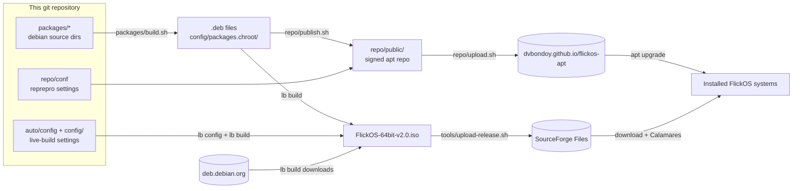

## What FlickOS is

| Property | Value |
|---|---|
| Version | 2.0 (1.x was based on Ubuntu 20.04/LXLE; no in-place upgrade) |
| Base | Debian 13 "trixie", `amd64` only |
| Desktop | labwc (Wayland compositor, Openbox-style) + waybar, sfwbar (Cupertino's dock), mako, fuzzel, foot, pcmanfm. Three desktop layouts, switchable live from *Settings → Desktop Layout & Style*: **Redmond** (default, one bottom panel), **Cupertino** (top bar and auto-hiding dock), **Traditional** (top panel and window list) |
| Look | **Arc-Dark** everywhere by default: GTK theme (arc-theme), Numix-Circle icons, and the same palette for panel, terminal, launcher, notifications, window borders, boot menus, boot splash and installer. A **Light** style (Arc, Numix-Circle-Light) recolors the desktop live; boot menus, splash and installer stay Arc-Dark. GTK details in *Settings → Appearance* (nwg-look). Translucent panel and terminal (no blur) |
| Audio | PipeWire + WirePlumber |
| Network | NetworkManager + nm-applet |
| Apps | Firefox ESR (with uBlock Origin), LibreOffice, VLC, Mousepad, Ristretto, Evince, Xarchiver, GNOME PackageKit (software manager); Bluetooth, printing, Flatpak (Flathub) |
| Updates | Automatic security updates (unattended-upgrades) |
| Security | Firewall (ufw) on by default: incoming blocked, outgoing allowed |
| Branding | FlickOS boot menu, boot splash (Plymouth), `os-release` variant and login banner; `ID=debian` kept |
| Login | Graphical login screen on installed systems (greetd + gtkgreet, `flickos-greeter`), optional automatic login. The live session logs in automatically on tty1 |
| Installer | Calamares with FlickOS branding (`flickos-installer`) |
| Image | `FlickOS-64bit-v2.0.iso`: hybrid ISO, boots on BIOS (syslinux) and UEFI (GRUB); can be written to USB |
| Published at | ISOs: SourceForge Files. Apt repository: https://dvbondoy.github.io/flickos-apt/. Code: GitHub `dvbondoy/FlickOS` |

## The big picture

A distribution is mostly **a selection of packages plus some configuration**.
FlickOS doesn't compile its own software. It combines Debian's packages with
a few small packages of its own.



There are two delivery paths, and you need both:

1. **The ISO** is how people *get* FlickOS. It contains a snapshot of every package.
2. **The apt repository** is how installed systems get *updates* to FlickOS's own
   packages. Debian's packages keep updating from Debian's servers as usual.

That's why customizations go into `.deb` packages and not straight into the
image: a file copied straight into the image never changes again after
installation.

## Repository layout

```
flickos/
├── README.md                     Start here
├── LICENSE                       GPL-3.0
├── docs/                         This documentation
│
├── auto/                         live-build "auto" scripts
│   ├── config                    ALL live-build options (distribution, bootloaders, ISO name…)
│   └── clean                     Cleans build output AND generated config
│
├── config/                       live-build input (hand-written parts)
│   ├── package-lists/            Which packages go into the image
│   ├── hooks/normal/             Shell scripts run inside the image during build
│   ├── bootloaders/              ISO boot menu: splash images, entry names, timeouts
│   └── packages.chroot/          (generated, git-ignored) local .debs to install
│
├── packages/                     FlickOS's own Debian packages
│   ├── build.sh                  Builds all of them into config/packages.chroot/
│   ├── flickos-desktop/          Meta-package: the whole desktop as dependencies
│   ├── flickos-settings/         Desktop config: session, keybindings, menu, panel, theme, wallpaper
│   ├── flickos-layouts/          Desktop layouts, wallpapers + the flickos-layout tool (and its unit tests)
│   ├── flick-tiler/              Opt-in window tiling on top of labwc (daemon + panel button)
│   ├── flickos-shortcuts/        Keyboard shortcut sheet while Super is held (daemon + GTK sheet)
│   ├── flickos-control/          The Settings window (pages over flickos-layout, flick-tiler, flickos-shortcuts)
│   ├── flickos-greeter/          Login screen of installed systems (greetd + gtkgreet)
│   ├── waypaper/                 Wallpaper picker (upstream waypaper, not in Debian trixie)
│   ├── sfwbar/                   Auto-hide dock for Cupertino (upstream sfwbar, compiled; not in Debian trixie)
│   ├── flickos-installer/        Calamares config + branding, live-session menu
│   ├── flickos-branding/         Logo icons, boot splash theme, OS name, login banner, FlickOS version (flickos-release)
│   └── flickos-archive-keyring/  Public key + apt source for the FlickOS apt repo
│
├── tools/                        Developer scripts
│   ├── build-iso.sh              Clean + build packages + build ISO
│   ├── test-iso.sh               Boot the ISO / install / installed disk in a QEMU window
│   ├── boot-test.py              Headless boot test (also runs in CI)
│   ├── upload-release.sh         Upload ISO + SHA256SUMS to SourceForge Files
│   ├── check-palette.py          Checks every config file uses the Arc-Dark palette
│   ├── check-menus.py            Checks the installed and live root menus are in sync
│   ├── make-layout-previews.sh   Generates the desktop layout chooser previews
│   └── make-placeholder-art.sh   Generates placeholder wallpaper/logo images
│
├── repo/                         apt repository tooling
│   ├── conf/                     reprepro configuration
│   ├── new-key.sh                One-time: create the signing key
│   ├── publish.sh                Build packages and add them to the repo
│   ├── upload.sh                 Push the repo to dvbondoy.github.io/flickos-apt
│   ├── db/                       (generated, git-ignored) reprepro database
│   └── public/                   (generated, git-ignored) the repo to upload
│
├── .test-vm/                     (generated, git-ignored) test-iso.sh disk + UEFI vars
├── boot-test/                    (generated, git-ignored) boot-test.py serial log + screenshot
│
└── .github/workflows/iso.yml     CI: builds the ISO on every push
```

Files and folders that `lb config` and `lb build` create (`config/binary`,
`config/common`, `chroot/`, `binary/`, `cache/`, `.build/`, `*.iso`, …) are
git-ignored. Never edit them by hand. They are regenerated on every build.

## Boot and session flow

What happens when someone boots the ISO:

1. **Bootloader:** syslinux (BIOS) or GRUB (UEFI) shows the FlickOS boot menu
   (`config/bootloaders/`) and, after 10 seconds, loads the kernel with the
   options from `--bootappend-live` in `auto/config`:
   `boot=live components quiet splash username=user hostname=flickos`.
   `splash` makes Plymouth show the FlickOS boot splash.
2. **live-boot** (in the initramfs) finds the compressed root filesystem
   (`live/filesystem.squashfs`) on the ISO and mounts it with a writable
   RAM overlay. Changes are lost on reboot.
3. **live-config** runs early in boot. It creates the user `user` (password
   `live`) and sets the hostname to `flickos`.
4. **live-config-systemd**'s getty generator sees `boot=live` and writes
   autologin settings for tty1–6 to `/run`, which lives in RAM only.
5. `user` is logged in automatically on tty1. The login shell reads
   `/etc/profile.d/95-flickos-session.sh` (from `flickos-settings`), which on
   tty1 only runs `flickos-session`. That puts the FlickOS config directories
   first in `XDG_CONFIG_DIRS`, runs `flickos-layout prepare` to generate the
   desktop layout's and style's files in `$XDG_RUNTIME_DIR/flickos/xdg` (which
   goes first of all), passes the keyboard layout to labwc, and runs
   `exec labwc`.
6. **labwc** reads `rc.xml`, `menu.xml`, `environment` and `autostart`. The
   autostart runs `/usr/libexec/flickos/autostart`, which starts the wallpaper,
   the panel and notifications (`flickos-layout panel`, which runs mako and
   waybar for the chosen layout and style), tray applets, polkit agent,
   clipboard history, night light,
   and (installed systems only) screen lock/idle.
7. Right-clicking the desktop opens the root menu. In the live session it comes
   from `flickos-installer` and starts with **Install FlickOS**, which runs
   `flickos-install` → Calamares. Calamares removes `flickos-installer` from the
   installed system, so the entry is gone there.

Details of every piece: [09 – Customizing](/docs/09-customizing/).

On an **installed** system there is no getty autologin. Instead the login
screen appears on VT 7: **greetd** (enabled as `display-manager.service`)
runs gtkgreet in the cage kiosk compositor (`flickos-greeter`). After the
password it starts `flickos-session`, and the flow continues from step 5.
If the user chose *Log in automatically* in the installer, they are in the
group `autologin` and greetd logs them in once per boot without asking. The
login screen never runs in the live session (its systemd drop-in has
`ConditionKernelCommandLine=!boot=live`). tty1 keeps a text login, which
starts the same session.

## Where to change what

| I want to… | Change | Doc |
|---|---|---|
| Add or remove an app for everyone | `packages/flickos-desktop/debian/control` | [04](/docs/04-packages/) |
| Change keybindings, menu, startup programs, panel, theme, default wallpaper | `packages/flickos-settings/` | [09](/docs/09-customizing/) |
| Add or change a desktop layout, or change the default layout | `packages/flickos-layouts/` | [09](/docs/09-customizing/#desktop-layouts) |
| Change the Dark/Light styles, or add a style | `packages/flickos-layouts/usr/share/flickos/styles/`, labwc themes in `packages/flickos-settings/usr/share/themes/` | [09](/docs/09-customizing/#styles-darklight) |
| Change a layout's wallpaper, or the Wallpaper app (waypaper) | `packages/flickos-layouts/usr/share/flickos/layouts/ID/wallpaper.jpg`, `packages/waypaper/` | [09](/docs/09-customizing/#wallpaper) |
| Change window tiling (arrangements, keys, apps that float) | `packages/flick-tiler/` (`MODES`, `KEYBINDS`, `etc/xdg/flickos/tiler.conf`), Super+T in `packages/flickos-settings/etc/xdg/labwc/rc.xml` | [09](/docs/09-customizing/#window-tiling) |
| Change the hold-Super shortcut sheet (descriptions, hold time, look) | `packages/flickos-shortcuts/` (`COMMANDS`, `ACTIONS`, `HOLD_MS`, `usr/share/flickos/shortcuts/style.css`) | [09](/docs/09-customizing/#shortcut-sheet-hold-super) |
| Change the Settings window (pages, tiles for other apps, mouse/touchpad/keyboard options) | `packages/flickos-control/usr/bin/flickos-control` (`PAGES`, `TILES`, `SETTINGS`); *All Settings* in both menus | [09](/docs/09-customizing/#settings-window) |
| Change mouse, touchpad, keyboard or idle defaults for everyone | `packages/flickos-control/etc/xdg/flickos/input.conf`, `keyboard.conf`, `idle.conf` | [09](/docs/09-customizing/#settings-window) |
| Change what a click on the desktop does | `flickos-layout` (`CLICKS`), `packages/flickos-settings/etc/xdg/labwc/rc.xml` (`<mouse>`) | [09](/docs/09-customizing/#desktop-clicks) |
| Change the Desktop Layout & Style chooser or its previews | `packages/flickos-layouts/usr/bin/flickos-layout` (`pick`), `tools/make-layout-previews.sh` | [09](/docs/09-customizing/#the-chooser) |
| Stop or change the chooser at a new account's first login | `packages/flickos-layouts/etc/skel/.config/flickos/choose-layout`, `flickos-layout first-run` | [09](/docs/09-customizing/#first-login) |
| Change installer branding or behavior | `packages/flickos-installer/` | [09](/docs/09-customizing/#installer) |
| Add a package only to the live ISO (not installed systems) | `config/package-lists/live.list.chroot` | [03](/docs/03-live-build-config/) |
| Enable a systemd service in the image | `config/hooks/normal/0100-services.hook.chroot` | [03](/docs/03-live-build-config/) |
| Change bootloader, kernel boot options | `auto/config` | [03](/docs/03-live-build-config/) |
| Change the FlickOS version (ISO name, os-release, …) | `packages/flickos-branding/usr/lib/flickos-release` + installer `branding.desc` | [06](/docs/06-ci-and-releases/#the-version-number) |
| Change the boot menu, boot splash, OS name, firewall | `config/bootloaders/`, `packages/flickos-branding/`, `config/hooks/normal/0200-firewall.hook.chroot` | [09](/docs/09-customizing/#boot-menu) |
| Change the apt repo URL (e.g. to flickos.net) | `packages/flickos-archive-keyring/etc/apt/sources.list.d/flickos.sources` | [05](/docs/05-apt-repository/#moving-the-repository-eg-to-flickosnet) |
| Ship an update to installed systems | bump version, `repo/publish.sh`, `repo/upload.sh` | [05](/docs/05-apt-repository/) |
| Make a release | tag `vX.Y` | [06](/docs/06-ci-and-releases/) |
