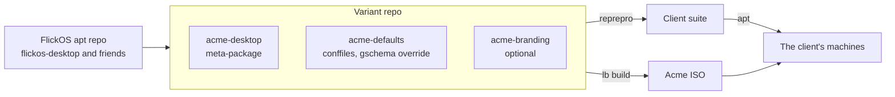

FlickOS as a base for someone else's product: a school's spin, an office fleet,
a PC builder's preinstall. This is the recipe for building a variant, which
parts of this repository it touches, and what has to be handed over with it.

Read [09 – Customizing](/docs/09-customizing/) first. That doc changes FlickOS
itself; this one keeps FlickOS as it is and builds something else on top.

- [What a variant is](#what-a-variant-is)
- [Choose the smallest layer that works](#choose-the-smallest-layer-that-works)
- [Layer 1: site defaults](#layer-1-site-defaults)
- [Layer 2: a variant meta-package](#layer-2-a-variant-meta-package)
- [Layer 3: a rebranded ISO](#layer-3-a-rebranded-iso)
- [A client apt suite](#a-client-apt-suite)
- [Unattended and OEM installs](#unattended-and-oem-installs)
- [Traps](#traps)
- [Making variants cheaper](#making-variants-cheaper)
- [Handover checklist](#handover-checklist)
- [Licensing and the name](#licensing-and-the-name)

## What a variant is

A variant is not a fork. Three knobs cover almost every request:

| Knob | What it decides | Where |
|---|---|---|
| Meta-package | Which apps are installed | a new package that depends on `flickos-desktop` |
| Defaults | How the desktop behaves out of the box | `/etc/xdg/flickos/*.conf`, a GSettings override, `/etc/skel` |
| Branding | Whose product it looks like | `flickos-branding`, `flickos-installer`, `flickos-greeter`, `config/bootloaders/` |

Everything else — the compositor, the layouts, the panel, the installer logic,
the update path — stays FlickOS and keeps getting FlickOS updates.



## Choose the smallest layer that works

| The client wants | Layer | Effort |
|---|---|---|
| Their apps, their wallpaper, a locked default layout | 1 + 2 | hours |
| The above, plus their name in the menu and login screen | 1 + 2, partial branding | a day |
| Their name everywhere, including boot splash, installer and ISO | 3 | a week, and it forks the build repo |
| Machines shipped preinstalled | 3 + OEM mode | see [below](#unattended-and-oem-installs) |

Resist layer 3 unless the client is paying for a product of their own. A
rebrand costs you the ability to say "run the FlickOS ISO and tell me what you
see" for the rest of the engagement.

## Layer 1: site defaults

No new packages. Everything here is a supported override point.

**Conffiles.** Each is shipped by the package that owns the setting, and dpkg
keeps local edits across upgrades — but see the warning below before planning
to ship them in a variant package:

| File | Package | Covers |
|---|---|---|
| `/etc/xdg/flickos/layouts.conf` | `flickos-layouts` | default layout, style, desktop clicks, apps button, start menu style |
| `/etc/xdg/flickos/input.conf` | `flickos-control` | mouse and touchpad |
| `/etc/xdg/flickos/keyboard.conf` | `flickos-control` | keyboard options |
| `/etc/xdg/flickos/idle.conf` | `flickos-control` | blank, lock and sleep times |
| `/etc/xdg/flickos/tiler.conf` | `flick-tiler` | tiling defaults |
| `/etc/xdg/flickos/menu.conf` | `flickos-menu` | pinned apps and sections |

**GTK and desktop settings.** `flickos-settings` ships
`usr/share/glib-2.0/schemas/90_flickos-settings.gschema.override`. A
higher-numbered file wins, so a variant ships `95_acme.gschema.override` and
never touches FlickOS's copy.

**New accounts.** `/etc/skel` is copied into every new account.
`flickos-layouts` already uses it for the first-login marker
(`.config/flickos/choose-layout`), so dropping the chooser for a fleet is one
deleted file.

**What not to do.** Never copy config into an existing `$HOME`, and never write
`~/.config/labwc/rc.xml` or `~/.config/waybar/`. The layout overlay in
`$XDG_RUNTIME_DIR/flickos/` exists so FlickOS can change a running desktop
without owning user files; a variant that writes into `$HOME` breaks every
later layout change and `flickos-layout doctor` will report it as damage.

**A variant package cannot ship those conffiles.** Those paths belong to
FlickOS packages, and two packages cannot own one file: dpkg fails the install
with *trying to overwrite ... which is also in package flickos-layouts*. Worse,
`layouts.conf`, `tiler.conf`, `input.conf`, `keyboard.conf` and `idle.conf` are
read from a **hardcoded** `/etc/xdg/flickos/` path, so no search order can
override them either. Only two things in this layer work from a package today:

| Mechanism | Works from a variant package? |
|---|---|
| `95_*.gschema.override` (glib merges by number) | **Yes** |
| `/etc/skel` | **Yes**, until an upgrade restores a file you deleted |
| `menu.conf`, `xdg-terminals.list`, `mimeapps.list` (searched in `XDG_CONFIG_DIRS`) | only with a site directory, which does not exist yet |
| `layouts.conf`, `tiler.conf`, `input.conf`, `keyboard.conf`, `idle.conf` | **No** |

So for a single machine, edit the conffiles by hand. For a fleet, either divert
them from the variant's maintainer scripts — messy on a conffile — or make the
change in [Making variants cheaper](#making-variants-cheaper) first.
[BUILD_A_VARIANT.md](../BUILD_A_VARIANT.md) walks into this wall deliberately
and shows both ways out.

## Layer 2: a variant meta-package

```
acme-desktop
    Depends: flickos-desktop, <the client's apps>
acme-defaults
    /etc/xdg/flickos/*.conf, 95_acme.gschema.override, /etc/skel/...
```

Two rules that are easy to get wrong:

1. **Use `Depends`, not `Recommends`.** `config/hooks/normal/0050-flickos-recommends.hook.chroot`
   queries `flickos-desktop` *by name* and installs only that package's
   Recommends. A variant meta-package's Recommends are installed by nothing.
   The `00recommends` apt config also stays on installed systems, so a new
   Recommends never reaches an existing install either.
2. **Keep the source out of `packages/`.** `packages/build.sh` loops over
   `packages/*/debian` and builds every one of them into
   `config/packages.chroot/`. A variant package placed there ships in the
   stock FlickOS ISO. Variant packages live in their own git repository and
   are built with `dpkg-buildpackage -us -uc -b`.

If the variant ISO must contain them, add them to a list in
`config/package-lists/` and to `REQUIRED` in
`config/hooks/normal/0010-sanity.hook.chroot`, so a missing one fails the build
in two minutes instead of at first boot.

## Layer 3: a rebranded ISO

Everything that carries the name:

| Shows | Owned by |
|---|---|
| ISO file name, version check | `tools/build-iso.sh`, from `packages/flickos-branding/usr/lib/flickos-release` |
| Volume label, application, publisher | `auto/config` (`--iso-application`, `--iso-volume`, `--iso-publisher`, `--image-name`) |
| `/etc/os-release`, `/etc/issue` | `flickos-branding` (diverts `base-files`) |
| Boot splash | `flickos-branding` (Plymouth theme) |
| Boot menu | `config/bootloaders/` |
| Installer | `packages/flickos-installer/etc/calamares/branding/flickos/` (`branding.desc`, `show.qml`, images) |
| Login screen | `flickos-greeter` (`/usr/share/flickos/greeter/`) |
| Root menu | `flickos-settings` `menu.xml` and `flickos-installer`'s live copy |

The name is spread across roughly sixty files, but only the table above is
user-visible. The rest are comments, package descriptions and paths.

**This forks the build repo, not the packages.** `auto/config` and
`build-iso.sh` hardcode the product name and derive the ISO name from
`flickos-release`, so a rebrand means a fork of the live-build configuration.
Keep the packages coming from the FlickOS apt repo so the variant still gets
updates.

**`flickos-branding` cannot simply be replaced.** It diverts `base-files`'
`/etc/os-release`, so two packages doing that conflict, and `flickos-desktop`
has a versioned `Depends: flickos-branding (>= 1.3)`. A replacement needs
`Provides: flickos-branding (= X)` together with `Conflicts` and `Replaces`,
and that combination has not been tried here — test it on a real install before
promising a date. See [Making variants cheaper](#making-variants-cheaper) for
the change that would remove the problem.

## A client apt suite

A client fleet should not track the same suite as the public, or an update you
publish on a Tuesday lands on their machines on a Tuesday.

`repo/conf/distributions` currently has one stanza (`Codename: trixie`,
`Components: main`), and `repo/publish.sh` hardcodes `reprepro ... includedeb
trixie`. A per-client suite means:

1. A second stanza, e.g. `Codename: acme`, same `SignWith` key.
2. Publishing the variant's packages into it, plus whichever FlickOS packages
   have been tested for that client.
3. Pointing the machines at it.

Step 3 is already designed for: `flickos.sources` is shipped by
`flickos-archive-keyring`, so the address can be changed on every installed
machine by publishing a new version of that package. A variant ships
`acme-archive-keyring` with its own `Suites:` line — and, if the client's repo
is signed with a different key, its own key. See
[05 – Apt repository](/docs/05-apt-repository/).

Whoever holds that suite has root on those machines, every day, forever. Treat
the signing key accordingly.

## Unattended and OEM installs

Two different things, often confused.

**Unattended** is for a rollout: one technician, forty machines, no clicking.
Calamares can be driven from a configuration rather than the UI.

**OEM** is for a factory: the machines are imaged before anyone knows who will
own them, and the buyer creates their account on first boot.

`packages/flickos-installer/etc/calamares/settings.conf` has `oem-setup: false`
and runs `users` in the interactive `show` phase, so neither is configured today.

**The two switches named "OEM" do not do what the name suggests.** Checked
against the module binaries of Calamares 3.3.14, the version in trixie:

| Switch | What it actually does |
|---|---|
| `oem-setup: true` | Calamares calls itself a *setup program* instead of an *installer*. A wording and UI mode (`isSetupMode`), defaulting to the value of `dont-chroot`. It configures nothing. |
| the `oemid` module | Writes an **OEM batch identifier** string into the target system — a build stamp for the vendor. One text field, nothing more. |

Neither defers account creation. The real out-of-box flow is that **Calamares
runs a second time, on the machine's first boot**, against the system that is
already installed — what this repo's own `settings.conf` comment calls "setting
up Calamares as a post-install configuration tool". That means:

1. A second settings file with a cut-down sequence — `welcome`, `locale`,
   `keyboard`, `users`, `finished` — and no `partition`, `unpackfs`, `mount` or
   `bootloader`, run with `dont-chroot: true` and `oem-setup: true`.
2. A factory install that creates **no** user account, so there is one for the
   buyer to create.
3. Something to run that second pass before the login screen on first boot, and
   only once. `flickos-greeter` starts greetd on VT 7 with no valid account to
   offer until the buyer has one, so the OOBE has to be ordered ahead of it.
4. A different `packages.conf`. The current one removes `calamares` **and**
   `flickos-installer` from the target on install — exactly what the first boot
   would still need. They have to survive the factory pass and be removed after
   the OOBE instead.

So this is not a flag: it is a second installer configuration plus a first-boot
service plus a change to what gets removed when. Budget days, not an evening.

> **Not run.** The behaviour above was read from the Calamares 3.3.14 module
> strings and this repo's configuration, not from a real OEM install. Validate
> before quoting anyone a date.

Two more things the factory path needs that the installer does not provide:

- **Clone safety.** A factory images one disk and copies it. `machine-id` and
  the SSH host keys must be regenerated on first boot, or every machine in the
  batch is the same machine on the network.
- **Their support address.** `supportUrl` in `branding.desc` must point at the
  vendor. If it points at the FlickOS issue tracker, you inherit their support
  queue for free.

On hardware: the ISO is built with `--firmware-chroot true` and
`config/hooks/normal/0060-trim-firmware.hook.chroot` removes only server and
ARM firmware (Qualcomm SoCs, Netronome, Tesla GSP, server HBAs). Wi-Fi,
Bluetooth, GPU and sound firmware all stay — about 555 MB of it. That is the
strongest argument on refurbished and mixed fleets, and it is worth saying out
loud. If a client needs a smaller image, extend `TRIM` deliberately; the hook
fails the build if apt would remove anything not on the list.

## Traps

Found the hard way, all still true:

| Trap | Consequence |
|---|---|
| `packages/build.sh` builds every `packages/*/debian` | a variant package in that tree ships in the stock ISO |
| `0050-flickos-recommends` reads only `flickos-desktop` | a variant's Recommends are installed by nothing |
| `--apt-recommends false` persists after install | a new Recommends never reaches existing installs; use Depends |
| `tools/check-palette.py` | a client's brand colors fail the build until added to the allowed lists, on purpose |
| `tools/check-menus.py` | the live menu must equal the installed one plus *Install FlickOS* |
| `FLICKOS_VERSION` vs `branding.desc` | `build-iso.sh` aborts on a mismatch; CI rejects a tag that is not `v$FLICKOS_VERSION` |
| reprepro | refuses a changed file at an existing version — every content change needs `dch -i -D trixie` |
| `Enabled: no` in `flickos.sources` | an offline-testing hack; never in anything handed over |

## Making variants cheaper

Three small upstream changes would turn "fork the build repo" into
"drop in three files". Worth doing before the second client, not the first:

1. **A site config directory, and readers that look in it.** This one is a
   prerequisite, not a nicety: without it a variant cannot set a single desktop
   default (see [Layer 1](#layer-1-site-defaults)). Two parts. `flickos-session`
   already prepends `/etc/xdg/flickos-live` to `XDG_CONFIG_DIRS` when it exists;
   the same three lines for `/etc/xdg/flickos-site`, above `/etc/xdg/flickos`,
   give variants a conflict-free overlay. Then `flickos-layout`, `flick-tiler`
   and `flickos-control` search `XDG_CONFIG_DIRS` for `flickos/<name>.conf`
   instead of hardcoding the path — which is what `flickos-menu` already does.
   Backwards compatible, since `/etc/xdg/flickos` is already on that path.
2. **Make the product name a variable.** `auto/config` and `build-iso.sh` both
   read `flickos-release` for the version already; reading `FLICKOS_NAME` for
   the ISO name, volume label and publisher costs nothing and removes most of
   the reason to fork.
3. **Let `flickos-branding` read a site file.** If the generated `os-release`
   and the Plymouth theme could be overridden without diverting the same file
   twice, a rebrand would stop being a fork of that package.

## Handover checklist

What goes with a variant, every time:

- [ ] The ISO, its `SHA256SUMS`, and the command that produced it
- [ ] The variant's git repository, including `debian/copyright` for every package
- [ ] The apt suite address, and who holds the signing key
- [ ] Which FlickOS version it is based on, and what "an update" will mean
- [ ] A named support contact, theirs or yours, in `supportUrl`
- [ ] What happens if you stop: it is Debian underneath, everything is
      GPL-3.0-or-later, the ISO rebuilds from the repository in CI. Put it in
      writing before you are asked.

## Licensing and the name

FlickOS is GPL-3.0-or-later (`LICENSE`), and every package carries a DEP-5
`debian/copyright`: `Files: *` for FlickOS's own work, a separate stanza for
everything from elsewhere. **A variant package needs its own `copyright`**, and
any file taken from somewhere else needs its own stanza.

The licence lets anyone rebuild FlickOS, including a client who stops paying.
What it does not let them do is call it FlickOS. The name and the artwork are
the only exclusive thing in a deal like this — which is exactly why a
white-label engagement licenses the name and hands over the code freely, rather
than the other way round.
